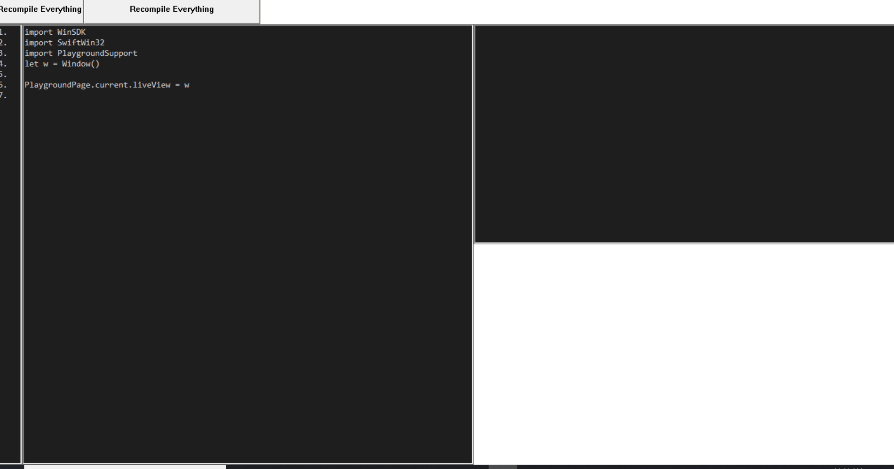

# swift-repl is an implementation of Swift playgrounds on Windows

## Building
First, build Swift on Windows by following the instructions [here](https://github.com/apple/swift/blob/master/docs/WindowsBuild.md). Only steps 1-8 are necessary.
Make sure you've cloned `swift-repl` into your `S:` drive. 
Next, install the latest [CMake](https://cmake.org/download/)
Finally, compile [SwiftWin32](https://github.com/compnerd/swift-win32).
Ensure that the following are at the top of your PATH:
```
S:\thirdparty\icu4c-64_2-Win64-MSVC2017\bin64
S:\b\llvm\bin
S:\b\swift\bin
S:\b\swift-win32
```
Now go back to your swift-repl directory and do the following.
```
mkdir S:\b\swift-repl
cd S:\b\swift-repl
"c:\Program Files\CMake\bin\cmake.exe" S:/swift-repl -G Ninja ^
            -DLLVM_DIR=S:\b\llvm\lib\cmake\llvm ^
            -DSwift_DIR=S:\b\swift\lib\cmake\swift ^
            -DClang_DIR=S:\b\llvm\lib\cmake\clang ^
            -DSwiftWin32_DIR=S:\b\swift-win32 ^
            -DCMAKE_BUILD_TYPE=RelWithDebInfo ^
            -DCMAKE_CXX_COMPILER=S:/b/llvm/bin/clang-cl.exe ^
            -DCMAKE_Swift_COMPILER=S:/b/swift/bin/swiftc.exe
ninja
```

To launch the REPL, just say
```
S:/b/swift-repl/swift-playground.exe ^
            -IS:/b/swift-win32/swift ^
	    -IS:/swift-repl/PlaygroundSupport ^
	    -IS:/b/swift-repl/swift ^
	    -LS:/b/swift-repl/PlaygroundSupport
```

